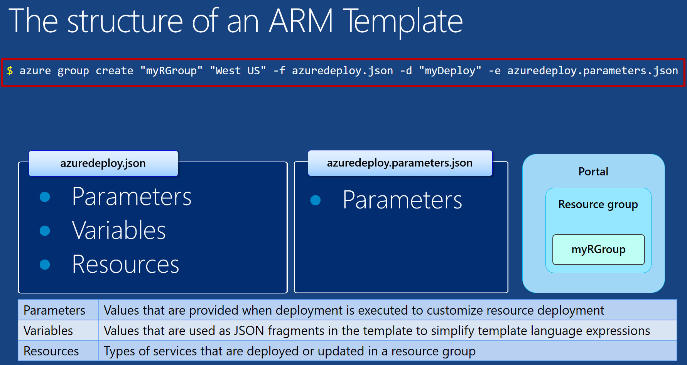
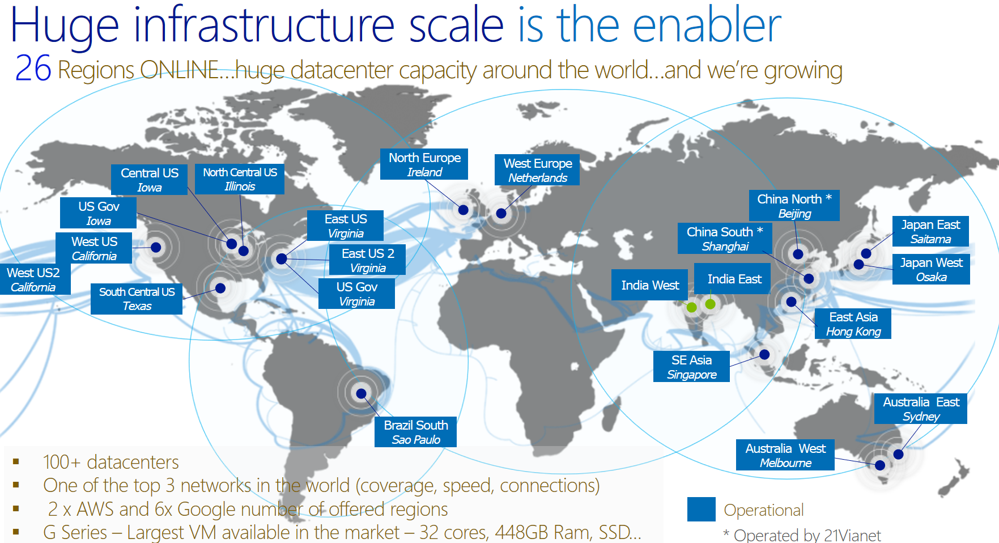

# Virtual Machine Scale Sets - Protecting your application's performance

Azure scale sets serve as the foundation for auto scaling your virtual machine infrastructure and based on performance indicators, such as CPU utilization and more. 

The purpose of this walk-through is to illustrate the following:

- How to provision Azure scale sets using the Azure Resource Manager Template mechanism
- How to construct or leverage an existing json-formatted template that provides the underlying scale set functionality
- How to use Azure commandline utilities as well as an Azure resource manager template to provision virtual machines that can leverage Azure scale sets
- A deep dive on instance count, storage account, virtual networks, public IP addressing, load balancers, and Azure scale sets, as well as the relationship among these different components
- A demonstration of how auto scaling kicks in to provision additional virtual machines in the deployment

## Provisioning Infrastructure in Azure

Before diving into the mechanics of Azure scale sets and how they work, let's quickly review how infrastructure gets provisioned in Azure. There are a variety of ways that you can provision infrastructure and Azure. We will focus on using the Azure command line utilities.

Notice in the diagram below that there are two json files that represent the infrastructure would like to provision. Using the Azure command line utilities, the infrastructure definition contained in those json files can be transformed into actual compute, storage, and networking infrastructure within a user's Azure subscription.


_Figure 1:  Using the cross-platform tooling to deploy infrastructure_

#### Azure Group Create

Notice in the figure below there is a red box around what appears to be a command. This command is the Azure command line tool.

Here are some things to realize about the command you see there:

````bash
$ azure group create "vmss-rg" "West US" -f azuredeploy.json -d "vmss-deploy" -e azuredeploy.parameters.json

````

- **azure group create** 
    - Is the fundamental command that builds out your infrastructure
- **vmss-rg** 
    - Is the name of your resource group, which is a conceptual container for all the infrastructure you deploy (VMs, Storage, Networking). If you delete a resource group, you delete all the resources inside of it.
- **WestUS** 
    - Is a data center where your deployment will take place
- **vmss-deploy** 
    - Is the name of the deployment (so you can refer back to it later)
- **azuredeploy.json** 
    - Is where you define the infrastructure you want to deploy
- **azuredeploy.parameters.json** 
    - Allows you to specify which values you can input when deploying the resources. These parameter values enable you to customize the deployment by providing values that are tailored for a particular scenario, like the number of VMs you want in your scale set

The Azure Cross Platform tooling can be downloaded here:

https://azure.microsoft.com/en-us/documentation/articles/xplat-cli-install/

My final point for the diagram below is that the most important section is the **Resources** section.



_Figure 2: Understanding how the Azure group create command works_

#### Choosing a data center

Azure's global footprint is always increasing. While we might've chosen the west US for our destination, there are many other options.



_Figure 3: Choosing a data center_

## Building a template so you can provision VMs in a VM Scale Set

The discussion above assumes that you already had define your json-formatted templates. So what we want to do now in this next section is actually walk through one of these templates. Luckily for us, there are some samples we can work from..

The repository on github contains many templates.

https://github.com/Azure/azure-quickstart-templates


_Figure 4:  Downloading sample ARM templates_

````bash
git clone https://github.com/Azure/azure-quickstart-templates.git
````

A simple clone command will download the templates locally.


_Figure 5:  Cloning the QuickStart templates locally_

We are interested in 201-vmss-ubuntu-autoscale. This example demonstrates some of the core features.


_Figure 6:  Viewing the auto scale set example_

## Viewing the Sample Template

So we will start exploring **azuredeploy.json**. In the first section, the parameter section, which was explained earlier, allows us to pass values to customize a deployment.

We may want to pass in different numbers of VMs per Scale Set.

In the figure below you will note that the first parameter is vmSku, and that simply represent the type of hardware we want to use. We are choosing Standard_A1, because that's a simple single core VM.

See this link: https://azure.microsoft.com/en-us/documentation/articles/virtual-machines-windows-sizes/

- A-series
- A-series - compute-intensive instances
- D-series
- Dv2-series
- DS-series*
- DSv2-series*
- F-series
- Fs-series*
- G-series
- GS-series


_Figure 7:  Choosing the VM size_

This next section simply indicates the **operating system type** (Ubuntu in this case).


_Figure 8:  Indicating the operating system_

**vmSSName** represents the name that we will get to the VM scale set. This is the higher level of abstraction above naming individual VM's.


_Figure 9:  Naming the scale set_

## Resources Section

We are going to skip over the **variables** section for now. instead, we will focus on the **resources** section, which is where we define the actual infrastructure we want to deploy it:

- The VM scale set itself
- Storage
- Networking
- Load balancers
- and more

## virtualNetworks

The VM's inside of the scale set will need to have a networking address space. 

Learn more here: https://azure.microsoft.com/en-us/documentation/articles/resource-groups-networking/


_Figure 10:  Specifying network information_

Storage accounts are needed because the underlying disk image that is hosting the operating system will need to be tied to a storage account. You will see this referenced later by the VM scale set itself.


_Figure 11:  Defining the storage accounts_

Public IP addresses are necessary because they provide the load balanced entry point for the virtual machines in the scale set. The public IP address will route traffic to the appropriate virtual machines in the scale set.


_Figure 12:  Public IP Address_

This is where you define the metrics that determine when you're scale set will scale up or scale down. There are a variety of metrics that you can use to do this. In the next section, **rules** defines which metrics will be used for scaling up scaling down.


_Figure 13:  Autoscale Settings_

Here between lines 311 and 320 you can see that the percent processor time is being used to scale up or scale down. Most of the time window indicates for five minutes if more than 60% of the processor capability is used, a scale up of that will be triggered. On lines 323 two 326, you can notice that we will scale up one VM if the percent processor time threshold is reached. An on line 322 through 326, you will note that we scale up for just one VM


_Figure 14:  Percent processor time as a scaling metric_

We also need to define how we scale back down. Notice that if the percent processor time dips below 30% for five minutes or more, we will scale down.


_Figure 15:  Scaling the cluster down_

Load balancing is used to route traffic from the public Internet to the load balanced set of virtual machines.

If you look closely on lines 181 and 182, you will notice that we define a front-end port range through which we can map to specific VM's. You will need to refer back to the resource file to really understand which specific numbers are being used. I have included an excerpt below.

So what this means is that if you SSH into port 50,000, you will reach the first VM in the scale set. If you SSH into 50,001, you will reach the second VM scale set. And so on.

````
"natStartPort": 50000,
"natEndPort": 50119,
"natBackendPort": 22,
````

Consecutive ports on the load balancer map to consecutive VM's in the scale set. 


_Figure 16:  Understanding the load balancer and the routing into scale sets_

Finally, we get to the core section where we specify that we want to use the VM scale sets.

On line 194 you will notice that there is a dependency on the underlying storage accounts, because the underlying VHD file for each of the VM's needs a storage account.

If you read the detailed sections of this particular resource, you will note that it leverages some of the previously defined resources, such as the operating system, the networking profile, the load balancer, etc.

Finally, towards the end, as you can see in the json below, we are defining some diagnostic resources so we can track the performance of our virtual machine scale sets. 

````json
"extensionProfile": {
"extensions": [
  {
    "name": "LinuxDiagnostic",
    "properties": {
      "publisher": "Microsoft.OSTCExtensions",
      "type": "LinuxDiagnostic",
      "typeHandlerVersion": "2.3",
      "autoUpgradeMinorVersion": true,
      "settings": {
        "xmlCfg": "[base64(concat(variables('wadcfgxstart'),variables('wadmetricsresourceid'),variables('wadcfgxend')))]",
        "storageAccount": "[variables('diagnosticsStorageAccountName')]"
      },
      "protectedSettings": {
        "storageAccountName": "[variables('diagnosticsStorageAccountName')]",
        "storageAccountKey": "[listkeys(variables('accountid'), variables('storageApiVersion')).key1]",
        "storageAccountEndPoint": "https://core.windows.net"
      }
    }
  }
]
}
````


_Figure 17:  Defining the virtual machine scale sets_

## Using the command line to provision our virtual machine scale set

Before diving into the command line. Let's finish off working with the azuredeploy.parameters.json file, which is where we customize or parameterize the deployment.

This is the file that is used to pass in parameters, such as the:

- **vmSku**
- **ubuntuOSVersion**
- **vmssName**
- **instanceCount** (how many VM's to include in the scale set initially)
- etc


_Figure 18:  Customizing the deployment_

Now we are ready to issue the command to provision that virtual machine scale sets using the Azure cross-platform tooling.

````bash
azure group create "vmss-rg" "West US" -f azuredeploy.json -d "vmss-deploy" -e azuredeploy.parameters.json
````

Note below that we are executing the **azure group create** command. It passed the preflight validation because we don't see any failure yet.


_Figure 19:  Executing the deployment_


Notice the things that we walk through previously within the template have now been made reality:

- Virtual machine scale set
- Load balancer
- Public IP address
- Various storage accounts


_Figure 20: The infrastructure that was deployed_

If we drill down to the details of the scale set, you will notice that currently it plumbs to the **instance count **that was passed in. As you recall, the **instance count** was 3in the parameters file.


_Figure 21:  Details of the VM scale set_

## Verifying that auto scaling is functioning

What we want to do now is stressed the system and force CPU utilization to rise above 60% for more than five minutes, so that we can see the scaling up of our VM's.

#### Stress

There is utility called **stress** that makes this easy.

To install stress execute the command line below:

````bash
apt-get installs stress
````

Once you do so, you can type in **stress** to see it's available parameters.


_Figure 21:  The stress command_

To make sure we go over five minutes we will set a timeout limit of 400 seconds.

````bash
 stress --cpu 8 --io 4 -c 12 --vm 2 --vm-bytes 128M --timeout 400s
````

A second console window can be used to view this CP utilization using a command called **top**.

````bash
top
````

Here you can see that that the CPU utilization is extremely low.


_Figure 104:  Output of top_


#### let's now stress one of the VM's and the scale set

As described before, this is the command that will do that.

````bash
 stress --cpu 8 --io 4 -c 12 --vm 2 --vm-bytes 128M --timeout 400s
````


_Figure 104:  Maxing out the CPU to trigger a scale event_


## Conclusion

This brief walk-through has taken you from beginning to and, allowing you to see how a scale set is constructed, how to set up some metrics to trigger scale up and scaled-down events. In addition, we leverage some tooling to actually see this take place.